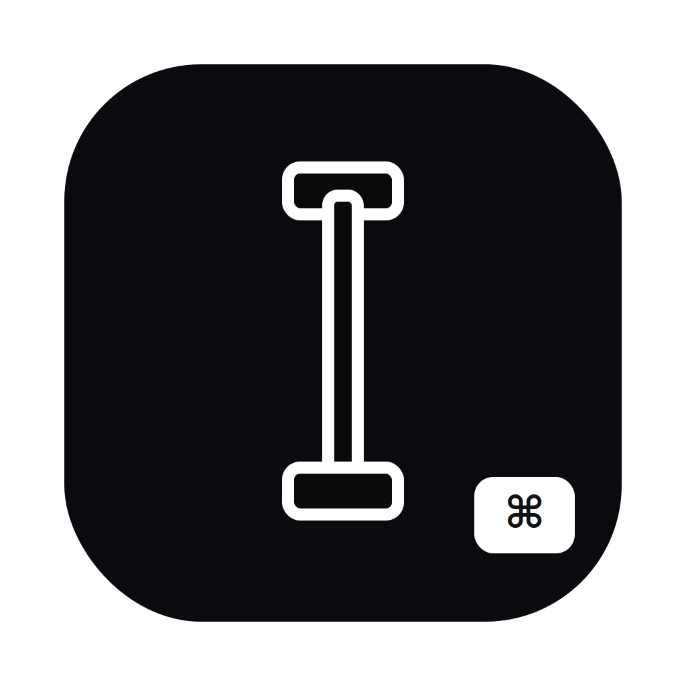

# AutoFn

<p align="center">
  
</p>

输入框聚焦时触发快捷键（自动启用微信/豆包语音输入法）


## 快速开始

脚本版（推荐用普通组合键）：

```bash
cd /Users/lessismore/Code/autofn
swift scripts/auto_hold_fn_on_input_focus.swift --hotkey ctrl+space
```

菜单栏 App：

```bash
cd /Users/lessismore/Code/autofn
bash scripts/build_auto_fn_menu_bar_app.sh
open dist/AutoFn.app
```

## 注意

- 需要在 macOS「系统设置 -> 隐私与安全性 -> 辅助功能」里给运行主体授权（终端或 AutoFnMenuBar.app）。
